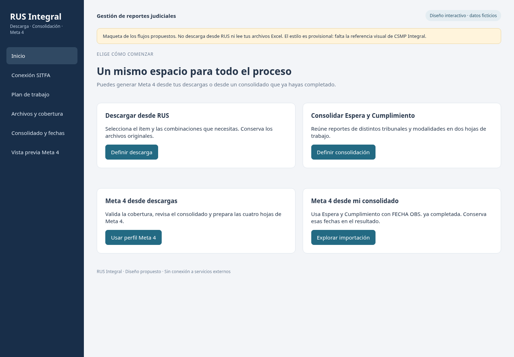

# Metas — RUS Integral

Herramienta propuesta para descargar reportes institucionales, consolidarlos en **Espera** y **Cumplimiento** y preparar **Meta 4**, incluyendo la generación desde un consolidado propio con **FECHA OBS.** ya completada.

Estado actual: **estudio y diseño**, con una maqueta interactiva y los motores originales conservados como referencia. La aplicación integrada todavía no está implementada.

## Documentación

- [Estudio y diseño funcional, revisión 2](docs/diseno/Estudio_y_diseno_RUS_Integral.md)
- [Integración del Descargador SITFA](docs/diseno/Anexo_integracion_Descargador_SITFA.md)
- [Documento técnico original del descargador](docs/diseno/Fuente_Descargador_SITFA_2_6_0_V4.md)
- [Comprobaciones realizadas y límites](docs/diseno/Validacion_del_estudio.md)
- [Plan de trabajo](docs/PLAN_DE_TRABAJO.md)
- [Registro del avance](docs/REGISTRO_DE_AVANCE.md)

## Explorar la maqueta

Descarga o clona este repositorio y abre [Maqueta_RUS_Integral.html](docs/diseno/Maqueta_RUS_Integral.html) en un navegador. No necesita instalación ni conexión.

Permite recorrer la conexión SITFA simulada, seleccionar tribunales/modalidades/estados, cargar el perfil Meta 4 de 68 combinaciones, retirar cruces específicos y cambiar FECHA OBS. para observar su traslado a la vista del informe.

La maqueta usa datos ficticios. No conecta con SITFA, no importa archivos Excel reales y no genera un documento oficial. La apariencia es provisional; CSMP Integral se utilizará únicamente como referencia visual cuando esté disponible.



## Fuentes conservadas

| Carpeta | Contenido |
|---|---|
| [fuentes/meta4_v2_4](fuentes/meta4_v2_4) | Motor original Meta 4 v2.4, lanzadores, documentación y pruebas |
| [fuentes/consolidador_excel](fuentes/consolidador_excel) | Consolidador original v1.2 y selector de carpeta |
| [fuentes/manifest_fuentes.json](fuentes/manifest_fuentes.json) | Huellas SHA-256 de los archivos de referencia |

Los motores se copiaron sin modificaciones; se excluyeron cachés de Python y de pruebas. No se incluye el ejecutable ni el código del descargador: su funcionamiento se estudió mediante el documento recibido.

La integración conservará aplicación local Windows, extensión Chrome y sesión SITFA autenticada por el usuario. Añadirá selección de varias modalidades y combinaciones específicas, consolidación común y generación independiente desde un consolidado propio.

## Comprobaciones del motor Meta 4

Con Python 3.10 o superior:

```bash
python -m pip install -r fuentes/meta4_v2_4/requirements-dev.txt
python -m pytest fuentes/meta4_v2_4/tests -q
```

El estudio inicial ejecutó las 57 pruebas incluidas: todas aprobaron. La documentación de validación distingue ese resultado de la comprobación visual de la maqueta y de la futura integración real con SITFA/Windows.

La ejecución de los motores originales se describe en sus respectivos archivos LEEME. Las pruebas usan datos ficticios; el repositorio no contiene reportes judiciales reales, credenciales ni sesiones del navegador.
